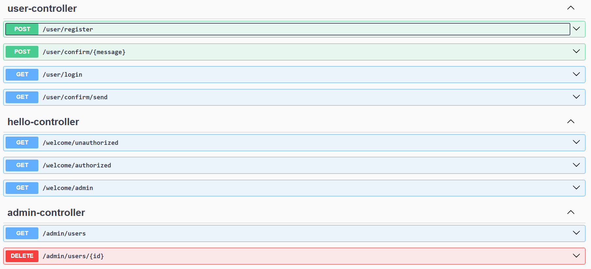

# DemoUserService API #

**DemoUserService  API** - демо RESTful API, предоставляющее возможность регистрации и входа с логином и паролем. Также при регистрации на почту пользователя отправляется сообщение для подтверждения почты.

## Технологии ##
API написан на языке **Kotlin** с использованием **Spring Boot** для внедрения зависимотей. Также важно отметить:
* для осуществления авторизации используеются **Spring Security**;
* для хранения и управления данными используется СУБД **PostgreSQL**;
* для взаимодействия с СУБД используется **Hibernate**;
* для документирования API используется **Swagger**;
* для отправки сообщений используется другой сервис, иснтрукции для которого отправляются посредством **Apache Kafka**.

## Структура проекта ##
Далее описаны основные составляющие проекта.

### Структура хранения в базе данных ###

Можно выделить 1 сущность в базе данных и это непосредственно пользователь (User).Она содержит следующие поля:
1. _id_ - уникальный идентификатор пользователя;
2. _login_ - логин для входа;
3. _email_ - электронная почта пользователя;
4. _password_ - пароль для входа;
5. _confirmation_ - флаг, сигнализирующий о наличии подтверждения почты;
6. _bio_ - информация о себе (опциональная информация).

### Авторизация ###

Для доступа ко всем эндпоинтам API используется базовая авторизация.
Существует 2 роли: 
* _COMMON_ -  авторизированный пользователь, который может поличить и зменить свои данные;
* _ADMIN_ - администратор, который может просматривать всех пользователей.
В API есть несколько эндпоинтов для проверки работы авторизации, о которых чуть дальше.
### Доступные эндпоинты ###
Эндпоинты, доступные без аутентификации:
1. **POST user/register** - регистрация пользователя, в теле запроса передаются данные пользователя. 
При этом в момент регистрации сразу отправляется письмо на почту пользователя для ее подтверждения. 
Если попытка отправки была неудачной, то об этом сообщается в теле ответа;
2. **POST user/confirm/{message}** - подтверждение почты, где message - ашифрованное сообщение, 
в котором хранится информация о том, к какому пользователю относится почта;
3. **GET user/login** - аутентификация пользователя, где в теле запроса передаются логин и пароль. 
В ответ присылается информация о пользователе (без пароля);
4. **GET user/confirm/send** - запрос на повторную отправку отправку сообщения на почту для ее подтвержденияю. 
В случает, если не удается отправить письмо на почту, об этом соодщается пользователю;

Эндпоинты, доступные только администатору:
1. **GET admin/users** - получение спаска всех пользователей;
2. **DELETE admin/users/{id}** удаление пользователя по его id.

Также в API есть ряд эндпоинтов, созданные для проверки работы авторизации:
1. **GET welcome/unauthorized** - доступен неавторизированным пользователям;
2. **GET welcome/authorized** - доступен авторизированным пользователям;
3. **GET welcome/admin** - доступен администратору.

Далее представлен скриншот того, как эти эндпоинты выглядят из swagger-ui:

### Модели доступа к данным ###

### Отправка сообщений в DemoMailService ###
Сообщения об инстуркциях для отправления писем отправляются в отдельный [DemoMailService](https://github.com/Octopus122/DemoMailService). 
Каждая инструкция имеет содержит следующую информацию:
1. адрес электронной почты, на которую необходимо отправить письмо;
2. тип письма (в нынешней реализации отправлются только письма для подтвержения почты);
3. данные - дополнительная информация, которой нужно дополнить письмо (например ссылка для подтверждения).

Как было сказано ранее инструкции отпрвляются при помощи Apache Kafka. Для того, чтобы предотвратить торможение и полное блокирование сервера при наличии
ошибок во время работы с брокером, максимальное время попытки осуществить отправку сообщений от продьюсера было выставлено 10 секунд.  

Также исключения, возникающие при работе брокера обрабатываются, о чем подробнее в следующем пункте.

### Обработка ошибок ###

### Дополнительная информация ###
Значительная часть переменных передается с помощью .env. Для демонстрации списка этих переменных используется .env.example.

## TO DO ##
В краткосрочной перспективе:
- [x] Написать про эндпоинты;
- [ ] Написать про модели данных;
- [ ] Написать про обработку ошибок;
- [x] Добавить обработку ошибок;
- [x] Добавить таймаут для отправки сообщений в Kafka
- [x] Добавить возможность повтроно отправить запрос на подтверждение почты;
- [ ] Добавить возможность смены пароля;
- [ ] Добавить возможность смены почты;

В долгосрочной перспективе:
- [ ] Добавить UserDetailService, получающий данные пользователя из базы данных;
- [ ] Сделать контроллеры асинхронными (по возможности, может и нет).